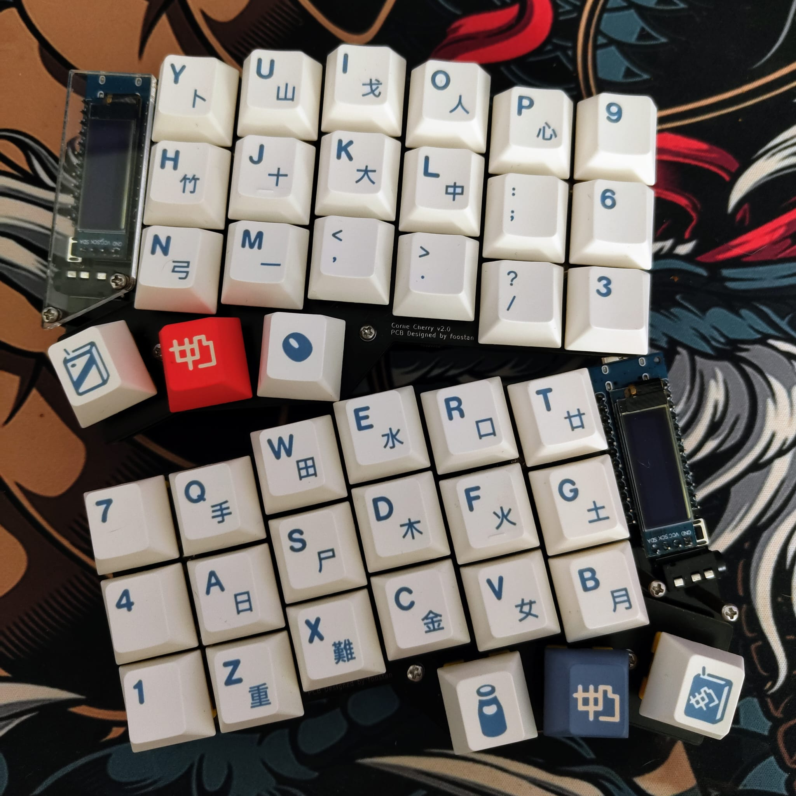

# My Corne Layout
I use an open source keyboard created by [foostan](https://github.com/foostan/crkbd).

Parts are from [Mechboards](https://mechboards.co.uk/products/helidox-corne-kit?variant=40391708082381#full-description).

The key caps are [GMK Soyamilk](https://cannonkeys.com/products/gmk-soyamilk).

